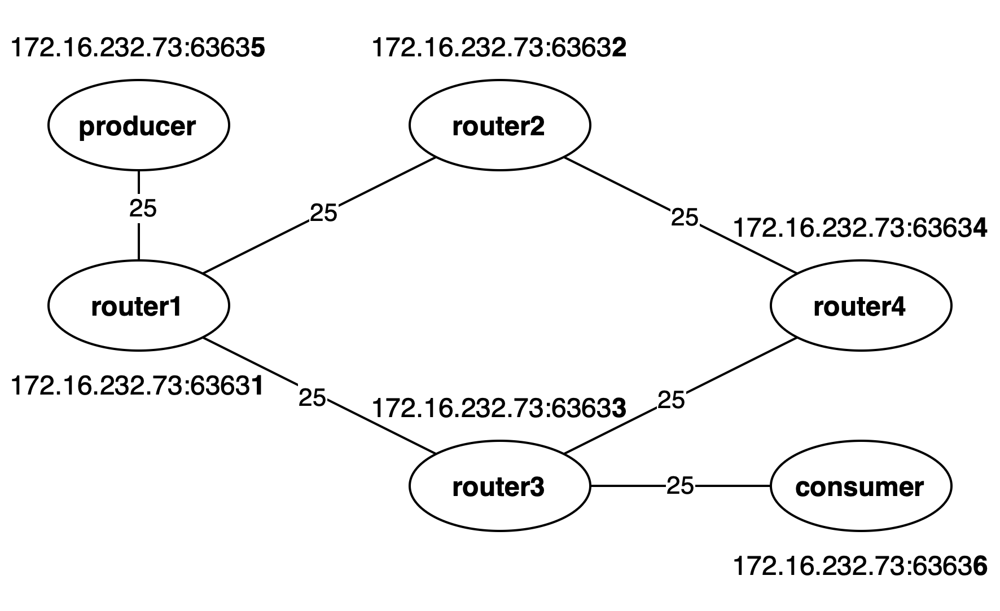

# nlsr-sample



## 上の図のネットワークを作る

ディレクトリに移動する

```bash
cd nlsr-sample
```

コンテナを起動する

```bash
./create.sh
```

NLSRの状態の確認　routing tableができていればOK

```bash
docker exec producer nlsrc status
```

## ProducerからConsumerにコンテンツを配信する

提供するコンテンツ(sample.txt)を作成する

```bash
docker exec -it producer bash
echo "Hello, world!" > sample.txt
```

コンテンツ名(/sample.txt)を広告する

```bash
docker exec -it producer bash
nlsrc advertise sample.txt
```

作成したコンテンツを提供する

```bash
docker exec -it producer bash
ndnputchunks /sample.txt < sample.txt
```

コンテンツを要求する

```bash
docker exec -it consumer bash
ndncatchunks /sample.txt
```

## コンテナを削除する

```bash
./delete.sh
```
